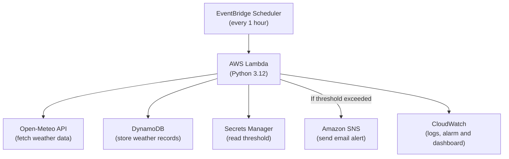

# Architectural Diagram

## Three Decision Table

| Decision | What We Chose | What We Rejected | Pillar | Justification |
|---|---|---|---|---|
| Database | DynamoDB on-demand | RDS PostgreSQL | Cost | RDS wins on ad-hoc SQL queries but incurs idle instance cost; DynamoDB pay-per-request fits the $100 Learner Lab budget. |
| Compute | AWS Lambda | EC2 / ECS | Cost + Operational Excellence | Pay-per-use execution, no idle server cost, and no operating-system patching make Lambda suitable for this low-volume hourly workload. |
| API | Open-Meteo | OpenWeatherMap | Cost | No API key or signup is required for the non-commercial free tier, and its 10,000 daily-call limit is more than sufficient for an hourly capstone workload. |

## Architecture Review Findings

| Finding | Accept / Push Back | One-line Response |
|---|---|---|
| Open-Meteo remains an external dependency | Accept | Lambda retries failed API requests up to three times, but prolonged API downtime could still prevent a weather record from being created. |
| SNS email is best-effort, not guaranteed delivery | Push back | Acceptable for the capstone demonstration; SNS email is sufficient for demonstration. |
| Secrets Manager is overkill for a single integer threshold | Push back | Using Lambda environment variables would require redeployment to change the threshold; Secrets Manager allows runtime updates. |
